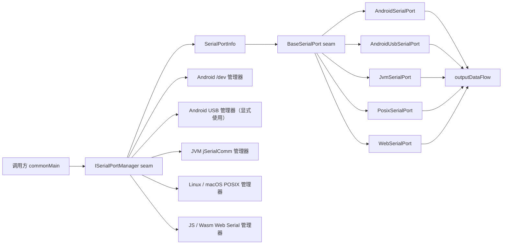
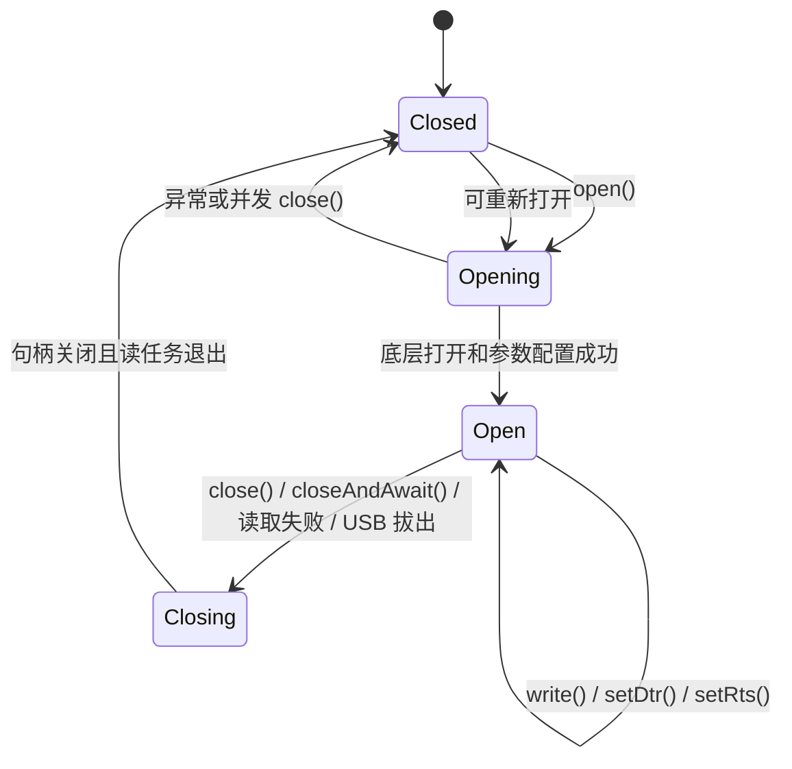

# DLSerialPortUtil 库架构与能力边界

本文面向维护和扩展 `library` 模块的开发者，说明当前实现的模块职责、运行时调用链、并发与资源约束，以及各平台 adapter 的能力边界。公开用法以根目录 [README.md](../README.md) 为准；本文关注实现为何这样组织，以及调用者不能从接口中推导出的约束。

## 1. 架构目标

库在 `commonMain` 建立两个主要 seam：

- `ISerialPortManager`：负责判断环境、发现或授权设备，并创建已经打开的串口对象。
- `BaseSerialPort`：负责单个串口连接的打开状态、读取、写入、控制线和关闭。

平台差异隐藏在各 source set 的 adapter 中。调用者不需要了解 Android 权限广播、JVM 串口对象、POSIX 文件描述符或 Web Stream，但必须遵守统一接口约定和本文列出的平台能力边界。

## 2. 源码分层

| 目录 | 职责 |
| --- | --- |
| `src/commonMain` | 公开接口、配置和设备模型、事件模型、Web 设备身份与事件去重所需的内部注册表 |
| `src/androidMain` | Android 机内 `/dev` 串口、Android USB 串口、USB 权限与拔出广播 |
| `src/jvmMain` | 基于 jSerialComm 的桌面串口实现 |
| `src/linuxMain` | Linux POSIX 设备发现、termios 配置和文件描述符 I/O |
| `src/macosMain` | macOS POSIX 设备发现、termios 配置和文件描述符 I/O |
| `src/jsMain` | Kotlin/JS 对 Web Serial API 的动态调用 |
| `src/wasmJsMain` | Kotlin/WasmJs 的 Web Serial 类型声明与实现 |
| `src/commonTest` | 不依赖真实硬件的身份和事件状态注册表测试 |

关键实现索引：

- 公共 seam：[ISerialPortManager.kt](src/commonMain/kotlin/com/d10ng/serialport/ISerialPortManager.kt)、[BaseSerialPort.kt](src/commonMain/kotlin/com/d10ng/serialport/BaseSerialPort.kt)
- 公共模型：[SerialPortInfo.kt](src/commonMain/kotlin/com/d10ng/serialport/SerialPortInfo.kt)、[SerialPortConfig.kt](src/commonMain/kotlin/com/d10ng/serialport/SerialPortConfig.kt)、[SerialPortEvent.kt](src/commonMain/kotlin/com/d10ng/serialport/SerialPortEvent.kt)
- Android 机内串口：[AndroidSerialPortManager.kt](src/androidMain/kotlin/com/d10ng/serialport/AndroidSerialPortManager.kt)、[AndroidSerialPort.kt](src/androidMain/kotlin/com/d10ng/serialport/AndroidSerialPort.kt)
- Android USB：[AndroidUsbSerialPortManager.kt](src/androidMain/kotlin/com/d10ng/serialport/AndroidUsbSerialPortManager.kt)、[AndroidUsbSerialPort.kt](src/androidMain/kotlin/com/d10ng/serialport/AndroidUsbSerialPort.kt)、[StartupInitializer.kt](src/androidMain/kotlin/com/d10ng/serialport/StartupInitializer.kt)
- JVM：[JvmSerialPortManager.kt](src/jvmMain/kotlin/com/d10ng/serialport/JvmSerialPortManager.kt)、[JvmSerialPort.kt](src/jvmMain/kotlin/com/d10ng/serialport/JvmSerialPort.kt)
- Native POSIX：[Linux PosixSerialPort.kt](src/linuxMain/kotlin/com/d10ng/serialport/PosixSerialPort.kt)、[macOS PosixSerialPort.kt](src/macosMain/kotlin/com/d10ng/serialport/PosixSerialPort.kt)
- Web：[JS WebSerialPort.kt](src/jsMain/kotlin/com/d10ng/serialport/WebSerialPort.kt)、[Wasm WebSerialPort.kt](src/wasmJsMain/kotlin/com/d10ng/serialport/WebSerialPort.kt)、[WebSerialApi.kt](src/wasmJsMain/kotlin/com/d10ng/serialport/WebSerialApi.kt)

`expect/actual` 只承担平台选择：

- `getPlatformSerialPortManager()` 返回当前平台的默认管理器。
- `buildPlatformSerialPort(info, config)` 创建当前平台默认的串口对象，但不自动调用 `open()`。
- `ISerialPortManager.open()` 创建串口对象并立即调用 `open()`，成功后才返回。

Android 是特殊情况：默认入口返回 `AndroidSerialPortManager`，只处理机内 `/dev` 串口。USB 串口必须显式使用 `AndroidUsbSerialPortManager`，`buildPlatformSerialPort()` 也不会根据 `SerialPortInfo` 自动切换为 USB 实现。

## 3. 核心接口约定

### 3.1 `ISerialPortManager`

| 成员 | 实现约定 |
| --- | --- |
| `isSupported()` | 表示当前运行环境具备该 adapter 的基础能力，不保证存在设备、已有权限或打开一定成功 |
| `listPorts()` | 返回当前可发现或已授权的端口快照，不持续跟踪后续变化 |
| `requestPort()` | 只由需要用户授权的平台覆盖；当前仅 Web 有实际行为 |
| `portEventFlow` | 当前只有 Web 发布公开的连接/断开事件；其他平台使用默认空 Flow |
| `open(info, config)` | 打开成功后返回 `BaseSerialPort`；权限、配置或底层打开失败会抛出异常 |

### 3.2 `SerialPortInfo`

- `id` 是平台范围内的端口标识，不保证跨平台或跨进程稳定。
- `description` 只用于展示，不应参与协议或设备类型判断。
- `obj` 是平台 adapter 的不透明句柄。JVM、Android USB 和 Web 的打开过程依赖它，不应序列化、跨进程传递或由业务代码替换。
- `SerialPortInfo` 是 data class，其相等性包含 `obj`。需要持久化选择时，应保存业务认可的设备属性并在下一次 `listPorts()` 后重新匹配，不能持久化整个对象。

不同平台的 ID 规则：

| 平台 | `id` 形式 | 稳定性 |
| --- | --- | --- |
| Android 机内串口 | `/dev/tty...` 绝对路径 | 取决于设备系统 |
| Android USB 单通道 | `UsbDevice.deviceName` | 只保证当前 Android 设备枚举周期可用 |
| Android USB 多通道 | `UsbDevice.deviceName#端口索引` | 同上；索引从 0 开始 |
| JVM | jSerialComm `systemPortName` | 取决于操作系统枚举，例如 `COM3` |
| Linux / macOS Native | `/dev/...` 绝对路径 | 取决于系统设备节点 |
| Web | `web-serial-N` 进程内编号 | 仅当前页面生命周期有效；重新接入会变化 |

### 3.3 `BaseSerialPort`

| 成员 | 实现约定 |
| --- | --- |
| `open()` | 重复打开同一对象时记录警告并返回；打开失败抛出异常并释放已经获得的资源 |
| `write(data)` | 成功完整提交给底层实现时返回 `true`；未打开或底层失败返回 `false` |
| `outputDataFlow` | 接收底层读取到的字节块，不代表完整业务报文 |
| `openStateFlow` | 只暴露已打开/未打开，不表达 Opening 或 Closing 中间状态 |
| `isDtrSupported` / `isRtsSupported` | 表示 adapter 或当前设备声明的能力；最终仍以设置方法返回值为准 |
| `setDtr()` / `setRts()` | 未打开、不支持或底层拒绝时返回 `false` |
| `close()` | 触发关闭；允许重复调用。Web 的实际资源释放是异步的 |
| `closeAndAwait()` | 等待读任务和底层资源释放，关闭后需要立即重连时应使用该方法 |

`config` 是传入对象的引用，并未在构造时复制。各 adapter 在 `open()` 时读取配置；打开后修改 `SerialPortConfig` 不会自动重新配置已经打开的串口。

## 4. 连接生命周期

Android、JVM 和 POSIX 实现使用生命周期锁、写锁或状态锁，并为每次打开分配 generation token。token 的作用是让旧读任务只能关闭自己对应的句柄，不能在快速关闭并重开后误关新连接。

主要不变量：

1. `openStateFlow=true` 时，当前 generation 已安装底层句柄和读任务。
2. 关闭先使当前 generation 失效，再取消读任务并释放句柄。
3. Android、JVM 和 POSIX 的并发写入会串行化，避免字节块在库内部交错。
4. POSIX 写入会处理部分写入、`EINTR` 和 `EAGAIN`，只有完整写完才返回 `true`。
5. 读取到 EOF、不可恢复错误或 Android USB 拔出时，连接会自动进入关闭流程。
6. `close()` 返回不等于所有平台的读任务都已经结束；需要确定性释放时统一使用 `closeAndAwait()`。

库没有提供自动重连。调用方应观察 `openStateFlow` 或捕获操作结果，自行决定是否重新枚举设备和建立新连接。

## 5. 接收数据与背压

`outputDataFlow` 是 `MutableSharedFlow<ByteArray>`，配置为：

- `replay = 0`：新订阅者不会收到订阅前的数据。
- `extraBufferCapacity = 64`：有订阅者时最多允许 64 个尚未消费的字节块缓冲。
- 读循环使用挂起式 `emit()`：缓冲区满后暂停继续读取，避免 Kotlin 堆内无限积压。

必须注意：

- 没有订阅者时，SharedFlow 不保留数据，读到的字节块会被丢弃。应在可能接收数据前启动收集。
- 一个 `ByteArray` 只对应一次底层 read 返回的数据。它可能包含半包、多包或任意协议片段。
- 库不做消息分帧、粘包拆分、编码转换、校验和或协议解析，这些属于上层协议模块。
- 背压只限制库内存。暂停读取期间，操作系统、USB 驱动或浏览器自身的有限缓冲仍可能溢出。
- Web 设备事件使用独立的 8 条缓冲并通过 `tryEmit()` 发布；极慢的事件消费者可能丢事件，库会记录警告。恢复状态时应重新调用 `listPorts()` 获取快照。

## 6. 平台 adapter

### 6.1 Android 机内串口

- 默认管理器扫描 `/dev` 下名称以 `tty` 开头且当前进程可读写的文件。
- 调用方也可以传入明确的 `/dev` 路径尝试打开；打开前会解析 canonical path，拒绝 `/dev` 之外的路径。
- 设备不可读写时，库尝试通过 `/system/bin/su -c "chmod 666 ..."` 调整权限，等待上限为 5 秒。失败后停止打开，不把不安全路径传给底层依赖。
- 使用 `android-serialport` 输入/输出流，读操作运行在 `Dispatchers.IO`。
- 不支持 DTR 和 RTS。
- 不公开设备热插拔事件，也不负责 root 获取、SELinux 策略或厂商权限配置。

`listPorts()` 会过滤当前不可读写的节点，因此某些可通过 root 调整权限的设备不会出现在列表中。这类设备需要调用方在确认型号和路径后显式构造 `SerialPortInfo`。

### 6.2 Android USB 串口

- 必须使用 `AndroidUsbSerialPortManager`，底层由 usb-serial-for-android 默认 prober 识别。
- 每个驱动通道返回一个 `SerialPortInfo`；多通道 ID 带 `#索引`。
- 未授权时先启动权限结果收集，再请求系统权限，最长等待 30 秒。
- AndroidX Startup 注册权限和拔出广播。拔出监听只在串口打开期间存在，收到对应设备拔出事件后关闭当前连接。
- 读写超时均为 2 秒；打开失败会同时释放串口和 `UsbDeviceConnection`。
- DTR/RTS 能力由具体 USB 驱动的 `supportedControlLines` 决定。
- `portEventFlow` 仍为空；拔出广播目前只用于关闭已经打开的连接，不向管理器调用方发布设备事件。

库不支持自定义 `UsbSerialProber`、驱动参数或未被默认 prober 识别的芯片注入。

### 6.3 JVM 桌面

- 使用 jSerialComm 枚举和打开端口，支持其覆盖的 Windows、Linux 和 macOS 环境。
- `SerialPortInfo.obj` 必须保留枚举得到的 jSerialComm `SerialPort` 对象；只构造相同 `id` 不足以打开。
- 打开时设置串口参数、关闭流控，并使用半阻塞读取模式。
- 支持 DTR/RTS；驱动拒绝时返回 `false`。
- 不公开设备热插拔事件。

### 6.4 Linux / macOS Native

- Linux 扫描 `/dev/tty*`；macOS 扫描 `/dev/tty.*` 和 `/dev/cu.*`。
- 列表只包含字符设备且能够以读写方式打开的节点。枚举检查会短暂打开再关闭设备。
- 打开后切换到阻塞模式，使用 raw termios，设置 `VMIN=0`、`VTIME=1`，读取最长约 100 ms 返回一次以检查取消状态。
- 软件和硬件流控均关闭；停止位和校验位标志会显式清除后再设置，避免继承旧设备配置。
- 支持部分写入重试以及 DTR/RTS ioctl。
- 不公开设备热插拔事件，也不提供 POSIX 目标之外的 Unix 平台实现。

### 6.5 Web JS / WasmJs

- `isSupported()` 只检查 `navigator.serial` 是否存在，不保证安全上下文、浏览器策略或设备权限允许操作。
- `listPorts()` 只返回当前站点已经授权的端口，不弹出选择器。
- `requestPort()` 必须由点击等用户手势直接触发；用户取消返回 `null`，其他浏览器异常继续抛出。
- 使用 Web `ReadableStream` / `WritableStream`；`close()` 启动异步清理，`closeAndAwait()` 等待读取取消、锁释放和 `SerialPort.close()` 完成。
- 只有 Web 管理器对外发布 `Connected` / `Disconnected`。事件状态按对象身份和短时间逻辑状态去重，内部跟踪数量有上限。
- 端口 ID 只在当前页面有效。设备断开会移除旧对象映射，再次接入必须使用新的 `SerialPortInfo`。
- DTR/RTS 最终通过 `setSignals()`；浏览器、系统或设备拒绝时返回 `false`。

Web Serial API 通常要求 HTTPS 或 `localhost`。iOS 浏览器和未实现 Web Serial 的浏览器不在能力范围内。

## 7. 配置能力边界

公共配置目前只支持以下离散值：

| 配置 | 支持值 |
| --- | --- |
| 波特率 | 9600、19200、38400、57600、115200 |
| 数据位 | 7、8 |
| 校验位 | None、Even、Odd |
| 停止位 | 1、2 |
| 流控 | 固定关闭，不提供配置项 |

当前不支持：

- 任意或平台特有波特率。
- 5/6 数据位、Mark/Space 校验、1.5 停止位。
- RTS/CTS、XON/XOFF 等可配置流控模式。
- 运行中重新配置；需要关闭后使用新 `SerialPortConfig` 重开。
- 字节发送间隔、break signal、环回测试或 RS-485 自动方向控制。

## 8. 明确不负责的功能

该库是串口传输 adapter，不是设备协议栈。以下能力应由上层模块实现：

- 报文边界、粘包/拆包、转义、CRC 和业务协议状态机。
- 请求响应关联、命令超时、重试、心跳和自动重连策略。
- 数据持久化、离线队列、无限接收缓存或无损事件历史。
- 设备业务身份识别；VID/PID、端口名和描述都不能单独视为永久业务 ID。
- 多进程或多应用独占协调。是否允许重复打开由操作系统和驱动决定。
- Android root、SELinux、USB host 硬件支持和厂商内核驱动安装。
- Web 安全上下文、Permissions Policy、用户授权和浏览器兼容性兜底。

## 9. 扩展新平台或新 adapter

新增实现时，优先保持现有 seam，不把平台类型加入公共方法参数。一个完整 adapter 至少需要：

1. 实现 `ISerialPortManager`，明确发现、授权和 ID 规则。
2. 实现 `BaseSerialPort`，把阻塞 I/O 放到合适 dispatcher。
3. 提供对应的 `actual getPlatformSerialPortManager()` 和 `actual buildPlatformSerialPort()`；若不是默认 adapter，应像 Android USB 一样提供显式管理器。
4. 保证打开失败释放所有已获得资源，关闭可重复调用。
5. 保证旧读任务不能关闭重开后的新句柄，并定义并发写入顺序。
6. 使用挂起式 `outputDataFlow.emit()`，不要恢复无上限缓冲或使用会静默丢接收数据的 `tryEmit()`。
7. 正确实现 `closeAndAwait()`，尤其是底层关闭本身为异步操作的平台。
8. 对动态能力使用 `isDtrSupported` / `isRtsSupported`，操作失败返回 `false`。
9. 增加不依赖硬件的单元测试，并至少完成目标编译；权限、拔插、读写和重连仍需真实设备验证。

## 10. 验证范围

自动化测试主要覆盖公共注册表的对象身份、事件去重和容量行为，并通过 KMP 构建验证各目标源码。自动化环境不能证明以下硬件行为：

- 特定 USB 转串口芯片的控制线和超时行为。
- Android root、SELinux 与设备节点权限。
- 不同 POSIX 驱动的 termios/ioctl 差异。
- JVM 各操作系统驱动的拔插和阻塞语义。
- 浏览器版本、Permissions Policy 和真实用户授权流程。

修改平台 adapter 后，应在相应真实设备上至少验证：枚举、首次授权、打开、持续收发、并发写入、拔出、关闭后立即重连和异常恢复。
